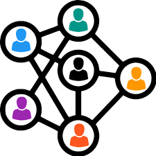

# 
## 👀 About me
```python
class lumusa2design:
    def __init__(self):
      self.education = ["🎮 Advanced technician in 3D animation, games and interactive envidoment design 🎮", "👨🏼‍🎓 degree in computer engineering of the Universidad de Las Palmas de Gran Canaria (In progress) 👨🏼‍🎓"]
      self.profession = "👨🏼‍💻 Programmer"
      self.country = "🌍Spain"
      self.city = "🌆Las Palmas de Gran Canaria"
      self.age = 25
      self.hobbies = ["Coding","Learning" ,"Videogames"]
      self.favourite_music = "Rock"
    
    def actions(self):
      while True:
        programming()
```

## 👨🏼‍💻 main projects

<table>
<tr>
<td width = 50%>
<h3 align="center">Algorithms</h3>
<a href="https://github.com/lumusa2design/algorithms">
</td>
<td width = 50%>
<h3 align="center">Neural network</h3>
<a href="https://github.com/lumusa2design/neural-network"></img></a>
</td>
</tr>
<tr>
<td width = 50%>
<h3 align="center">Jack of all games</h3>
<a href="https://github.com/lumusa2design/algorithms"></img></a>
</td>
<td width = 50%>
<h3 align="center">Linkcom</h3>
<a href="https://github.com/lumusa2design/neural-network">
</td>
</tr>
</table>

## 🌱 Currently Learning  

- 💻 **Computer algorithms**  
  <div style="background: #ddd; width: 100%; border-radius: 5px;">
    <div style="background: #4CAF50; width: 40%; padding: 2px; border-radius: 5px;"></div>
  </div>  
<br>

- 📲 **web and mobile development**  
  <div style="background: #ddd; width: 100%; border-radius: 5px;">
    <div style="background: #2196F3; width: 50%; padding: 2px; border-radius: 5px;"></div>
  </div>  
  
<br>

- 🤖 **Artificial inteligence**  
  <div style="background: #ddd; width: 100%; border-radius: 5px;">
    <div style="background: #FF9800; width: 15%; padding: 2px; border-radius: 5px;"></div>
  </div> 

  <br>

- 🧹 **Clean code and refactoring.**  
  <div style="background: #ddd; width: 100%; border-radius: 5px;">
    <div style="background: #9C27B0; width: 70%; padding: 2px; border-radius: 5px;"></div>
  </div>  

  <br>

- 🀄 **Programming in Lisp**  
  <div style="background: #ddd; width: 100%; border-radius: 5px;">
    <div style="background:rgb(255, 0, 0); width: 5%; padding: 2px; border-radius: 5px;"></div>
  </div> 


## 💡 Interests  


| <p align="center">⛳ Theme  </p>                      |<p align="center"> 🌟 Interest </p>|
|--------------------------------|------------|
| 🧩 **Game Development**         | ⭐⭐⭐ ☆ ☆ |
| 🤖 **Advanced Algorithms Knowledge** | ⭐⭐⭐⭐⭐ |
| 🧠 **General Knowledge Expansion**  | ⭐⭐⭐⭐⭐|
| 📡 **Tech & Innovation**       | ⭐⭐⭐⭐ ☆ |
| 🎮 **Gaming**       | ⭐⭐⭐⭐ ☆ |


## 💞️ Collaborations  

#### 🚀 **Excited to work on new projects!**  

### 🔥 Current Collaboration  
[](#)  
📋 **name of the project:** [Jack of all games](https://github.com/AVR21/jack-of-all-games)

👥 **With:** [AVR21](https://github.com/AVR21) , [AlvaroRB](https://github.com/AlvaroRB)  
📌 **Description:** A video game library manager that allows you to manage your games to your liking.

[](#)  
📋**name of the project:** [Linkcom](#)

👥 **With:** [AVR21](https://github.com/AVR21) , [Heliot Gonzalez](https://github.com/HeliotGonzalez/)  
📌 **Description:** Brief summary of what the project is about.   

[](https://github.com/lumusa2design/practicasFSO25)  
📋**name of the project:** [Practicas FSO](https://github.com/lumusa2design/practicasFSO25)

👥 **With:** [jesus-tdd](https://github.com/jesus-tdd/)  
📌 **Description:** Project of a Operative System Subject.  
<!--
### 📜 Past Collaborations  
[](#) - **[Name](#)** - Worked on **[Feature]** (Year).  
[](#) - **[Name](#)** - Contributed to **[Something]** (Year).  
[](#) - **[Name](#)** - Assisted with **[Task]** (Year).  
ar).  -->


## 📫 Contact
- **Instagram:** [@lumusa2design](https://www.instagram.com/lumusa2design)
- **LinkedIn:** [Luis Muñoz Sanz](https://www.linkedin.com/in/luis-mu%C3%B1oz-sanz-4314541a5)
---
<p><h2 align ="center">Languages and Tools</h2></p>
<p>
  
  
  
  
  
  
  
  
</p>

---
<p><h2 align = "center">Design tools</h2></p>
<p>
  
  
  
  
  
  
  
  
  
  </p>

---


## 📊 Stats
<div align="center">
  
  
</div>
<div align="center">

<br/>

</div>

## 🏆 GitHub Trophies


