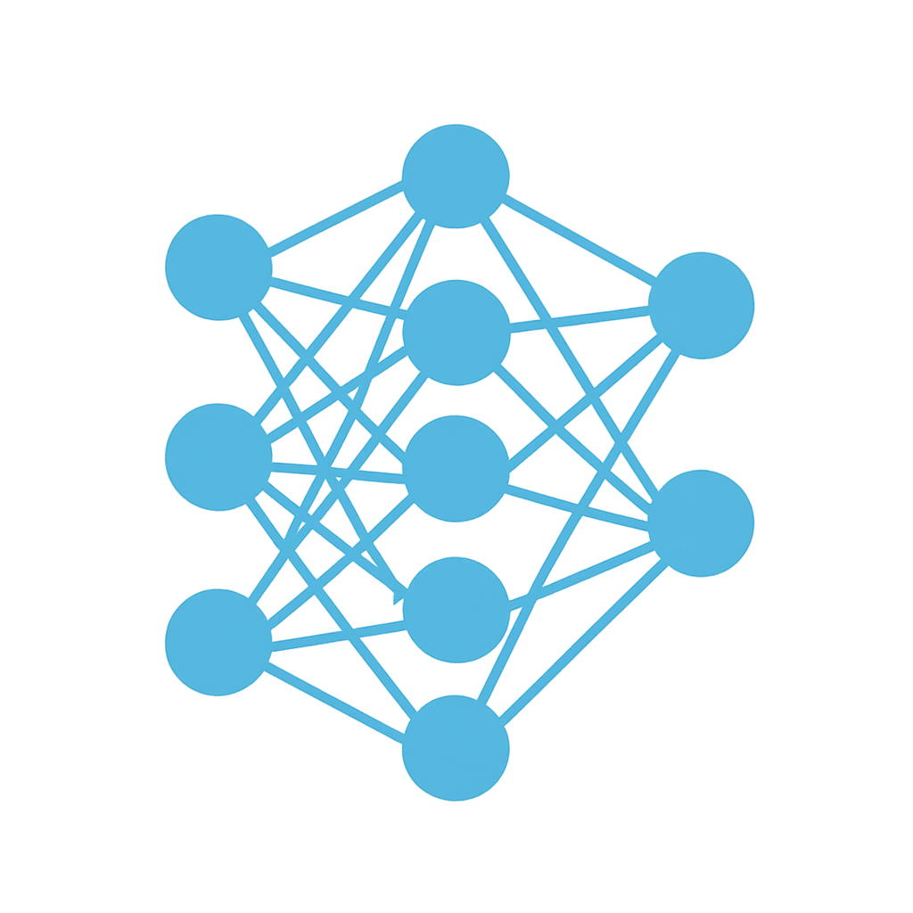
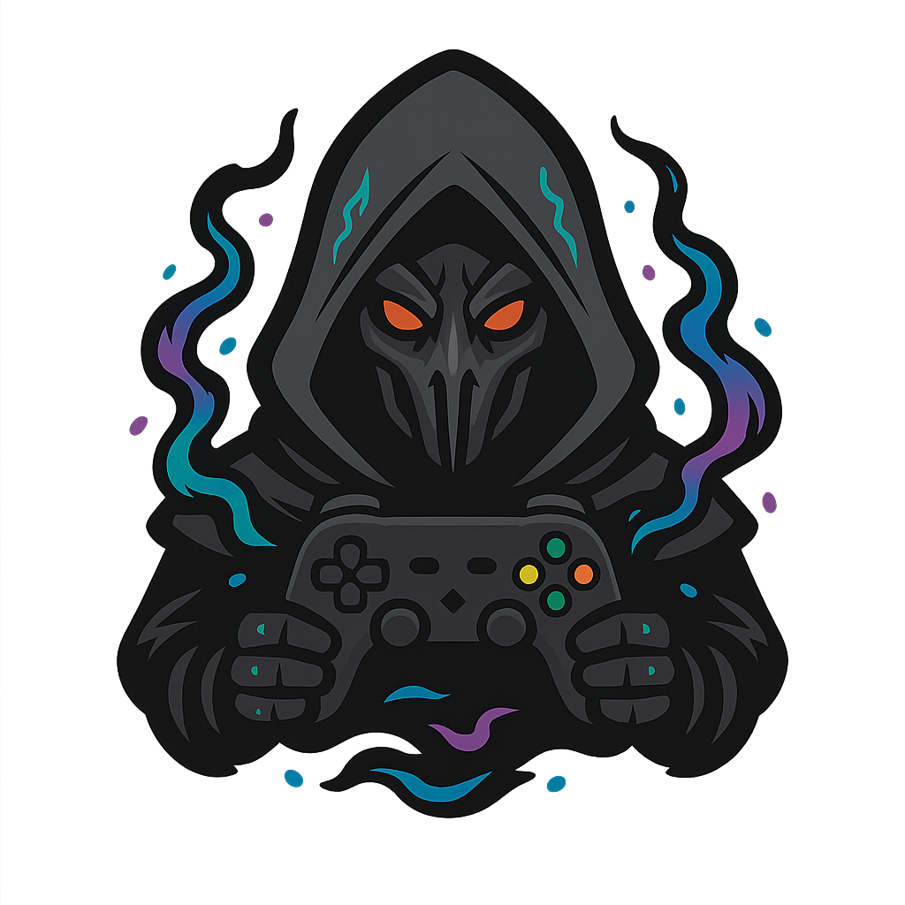
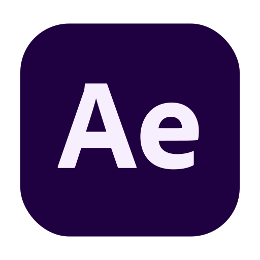
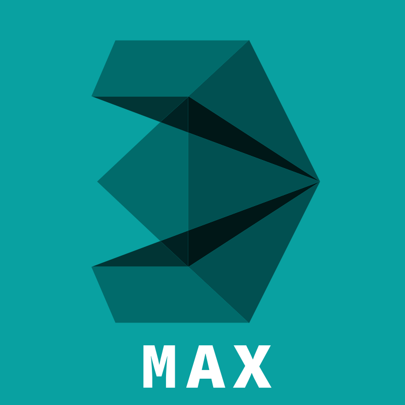

# 
## 👀 About me
```python
class lumusa2design:
    def __init__(self):
      self.education = ["🎮 Advanced technician in 3D animation, games and interactive envidoment design 🎮", "👨🏼‍🎓 degree in computer engineering of the Universidad de Las Palmas de Gran Canaria (In progress) 👨🏼‍🎓"]
      self.profession = "👨🏼‍💻 Programmer"
      self.country = "🌍Spain"
      self.city = "🌆Las Palmas de Gran Canaria"
      self.age = 25
      self.hobbies = ["Coding","Learning" ,"Videogames"]
      self.favourite_music = "Rock"
    
    def actions(self):
      while True:
        programming()
```

## 👨🏼‍💻 main projects

<table>
<tr>
<td width = 50%>
<h3 align="center">Algorithms</h3>
<a href="https://github.com/lumusa2design/algorithms">
</td>
<td width = 50%>
<h3 align="center">Neural network</h3>
<a href="https://github.com/lumusa2design/neural-network"></img></a>
</td>
</tr>
<tr>
<td width = 50%>
<h3 align="center">Jack of all games</h3>
<a href="https://github.com/lumusa2design/algorithms"></img></a>
</td>
<td width = 50%>
<h3 align="center">Linkcom</h3>
<a href="https://github.com/HeliotGonzalez/LinkCom-Frontend">
</td>
</tr>
</table>

## 🌱 Currently Learning  
- 💻 **Computer algorithms**  
  <span style="color:green">  ██████████████░░░░░░</span> 70%

- 📲 **Web and mobile development**  
  <span style="color:yellow"> ███████████░░░░░░░░░</span> 50%

- 🤖 **Artificial intelligence**  
  <span style="color:purple"> ██░░░░░░░░░░░░░░░░░░</span> 15%

- 🧹 **Clean code and refactoring**  
  <span style="color:red">██████████████░░░░░░</span> 70%


- 🀄 **Programming in Lisp**  
  <span style="color:blue">█░░░░░░░░░░░░░░░░░░░ </span>5%


## 💡 Interests  


| <p align="center">⛳ Theme  </p>                      |<p align="center"> 🌟 Interest </p>|
|--------------------------------|------------|
| 🧩 **Game Development**         | ⭐⭐⭐ ☆ ☆ |
| 🤖 **Advanced Algorithms Knowledge** | ⭐⭐⭐⭐⭐ |
| 🧠 **General Knowledge Expansion**  | ⭐⭐⭐⭐⭐|
| 📡 **Tech & Innovation**       | ⭐⭐⭐⭐ ☆ |
| 🎮 **Gaming**       | ⭐⭐⭐⭐ ☆ |


## 💞️ Collaborations  

#### 🚀 **Excited to work on new projects!**  

### 🔥 Current Collaboration  
<!--
[](https://github.com/lumusa2design/practicasFSO25)  
📋**name of the project:** [Practicas FSO](https://github.com/lumusa2design/practicasFSO25)

👥 **With:** [jesus-tdd](https://github.com/jesus-tdd/)  
📌 **Description:** Project of a Operative System Subject.  
-->

---


### 📜 Past Collaborations  
[](https://github.com/AVR21/jack-of-all-games) - **[Jack of all games](#)** - Worked as **Frontend developer** (2025).  
[]() - **[LinkCom](#)** - Contributed as **Full Stack developer** (2025).  
[](https://github.com/lumusa2design/practicasFSO25) - **[PracticasFSO](#)** - Contributed as **C Programmer** (2025).  

---

## 📫 Contact
- **Instagram:** [@lumusa2design](https://www.instagram.com/lumusa2design)
- **LinkedIn:** [Luis Muñoz Sanz](https://www.linkedin.com/in/luis-mu%C3%B1oz-sanz-4314541a5)


---
<p><h2 align ="center">Languages and Tools</h2></p>
<p>
  
  
  
  
  
  
  
  
  
  
  
  

</p>

---
<p><h2 align = "center">Design tools</h2></p>
<p>
  
  
  
  
  
  
  
  
  
  
  </p>

---
<p><h2 align="center">OS used</h2></p>
<p align="center">
  
  
  
  </p>


## 📊 Stats
<p align="center">
<a href="https://github.com/lumusa2design">
  
  
</a>

</p>
<p align="center">
  
</p>

## 🏆 GitHub Trophies

<p align="center">
  <a href="https://github.com/ryo-ma/github-profile-trophy">
    
  </a>
</p>

